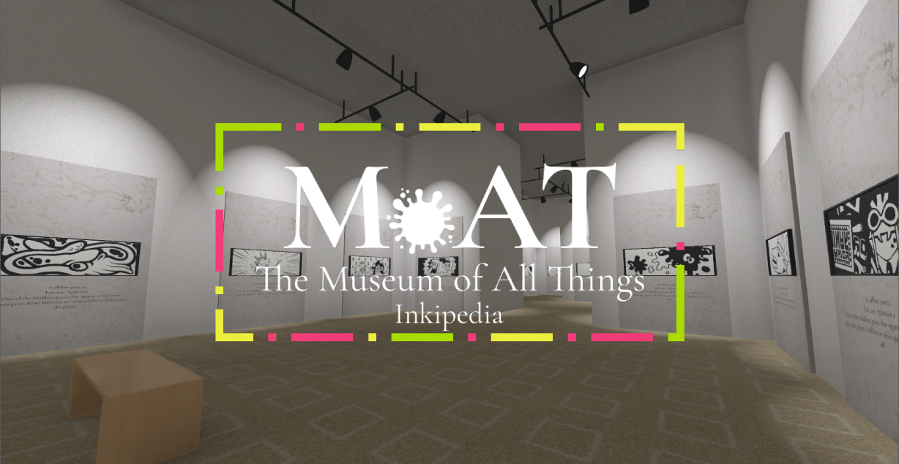

- **[Main Museum of All Things project homepage](https://may.as/moat)**

- [Download releases from Github](https://github.com/Fxfxfx0/museum-of-all-things-inkipedia/releases/)

The Goal of this fork of the Museum of All Things is to make an interactive 3d museum that is generated
procedurally, using content from Inkipedia, the Splatoon wiki, to fill exhibits. The museum is
virtually limitless, allowing you to take doors from one exhibit to another,
depending on what is linked from that Inkipedia article.

The text of the article is also inserted as informative plaques on the wall, so you
can read about the exhibit while looking at the pictures from it.

Every exhibit is filled with hallways to other exhibits, based on the links in the
current exhibit's Inkipedia page. You'll never run out of things to explore!

## Credits

All exhibit content is sourced from Inkipedia. This game is written in the [Godot engine](https://godotengine.org). Textures are from [AmbientCG](https://ambientcg.com/).

- Creator and Programmer of the main Museum of All Things project: [Maya](https://github.com/m4ym4y)
- Audio: [Willow Wolf @ Neomoon](https://neomoon.one) (Accepting work on game audio)
- Dramaturgy: Emma Bee Pernudi-Moon
